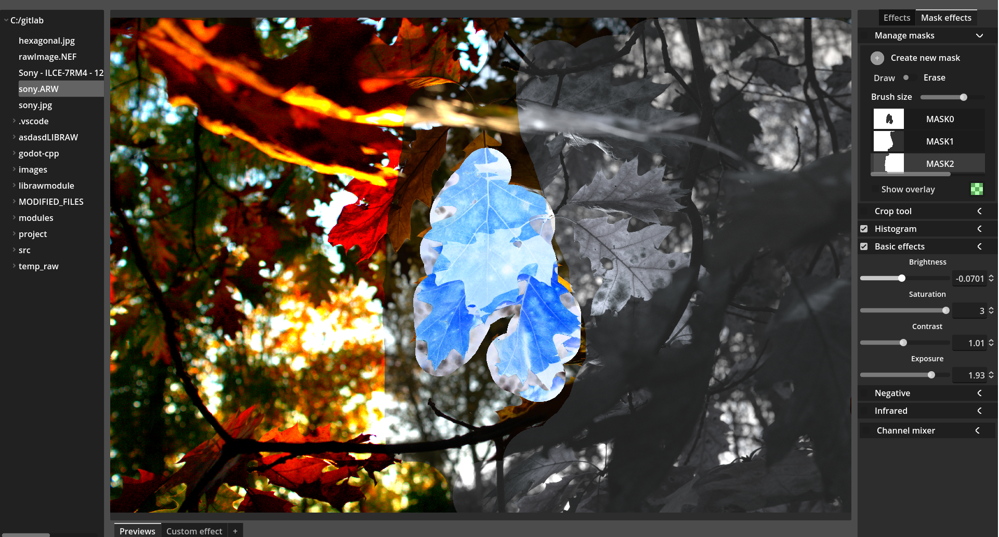
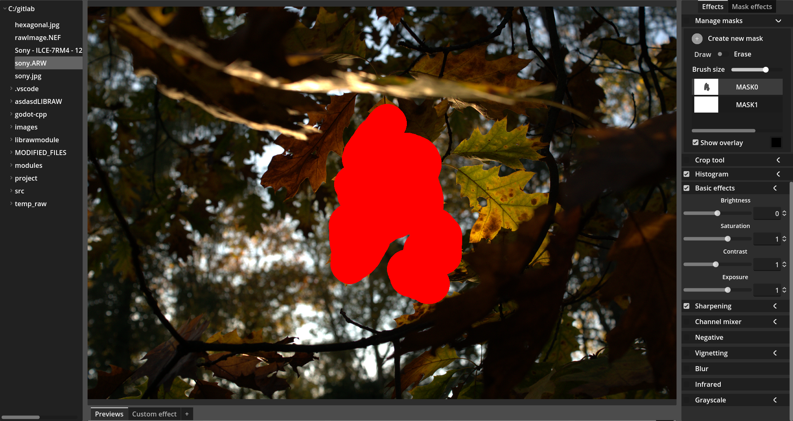
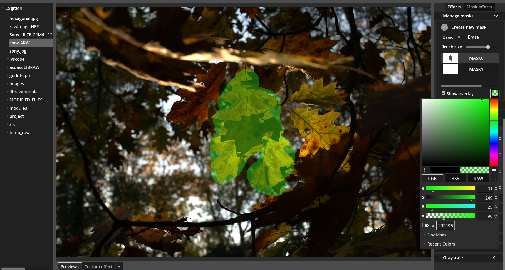
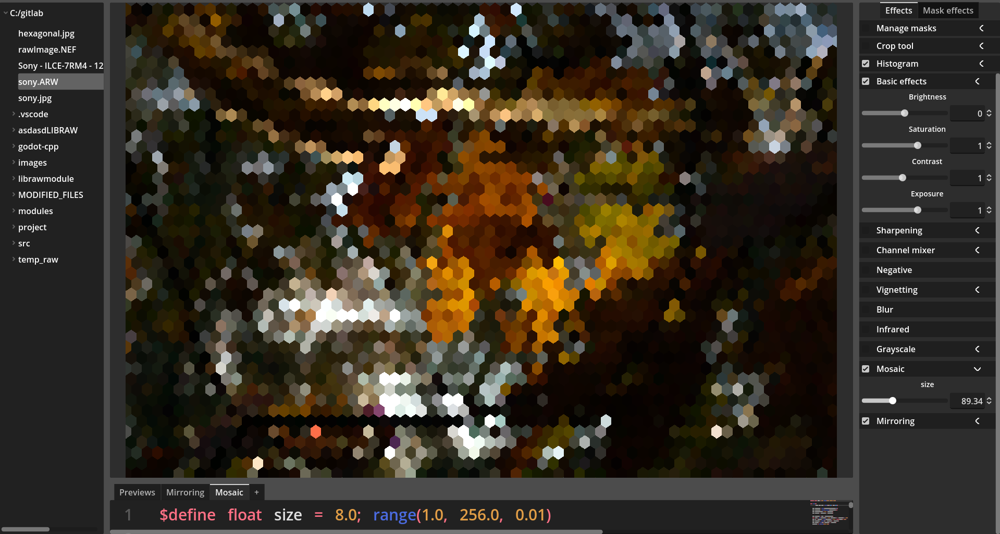

# RawGodot
This is a RAW image processor made with Godot.

It uses the Godot 4 Vulkan API for the image processing.

## Masking

With masks the user can apply the effects certain parts of the image. Multiple masks can be applied at the same time.

The default mask overlay color can be changed, aswell as the opacity of the overlay. 

## Custom effects
It is possible to create custom effects during runtime. The shader parameters defined in the code will their own sliders which can be adjusted.

